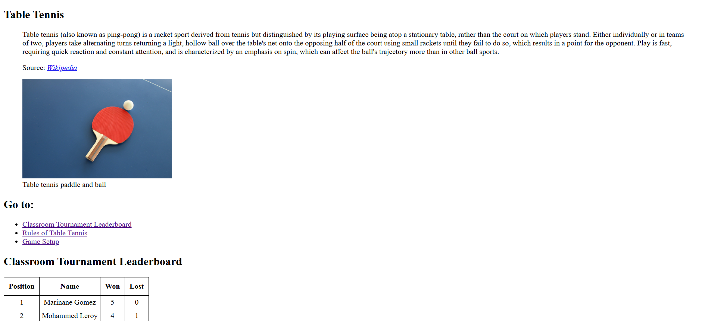

# 📁 Table Tennis Leaderboard

## ℹ️ a sports score website using HTML and minimal CSS

A HTML website with minimal CSS built as part of my earliest lessons in frontend development.

---

## 🔍 Overview

This project displays a fictional table tennis tournament leaderboard using semantic HTML and light CSS styling. I built this as a continuation of learning how to structure real-world data on the web.

It includes a ranked leaderboard, a breakdown of official rules, and a tournament-style match setup using semantic tags like `<section>`, `<article>`, `<figure>`, and `<table>`. I also practiced linking to external sources and improving page navigation.

---

## 🧠 What I Learned

- How to structure tabular data using `<table>`, `<thead>`, `<tbody>`, and `<tfoot>`
- When to use `<section>` vs. `<article>`
- How to group and caption images with `<figure>` and `<figcaption>`
- Linking to external sources using `<cite>` and `<a target="_blank">`
- Creating accessible, navigable content with internal anchor links
- Basic usage of CSS for page layout and image styling

---

## 🛠️ Tech Used

- HTML5
- CSS

---

## 🚀 How to Run

1. Clone the repository
2. Navigate to this project folder
3. Open `index.html` in your browser

---

## 🌐 Live Demo

Or you can check out the 👉 [live website here](https://beginner-portfolio-website.netlify.app/html5%20projects/project%202/)

---

## 🧑‍💻 Author

Created by **Elmar Chavez**

🗓️ Month/Year: **April 2025**

📚 Journey: **First month** of learning _frontend web development_.
